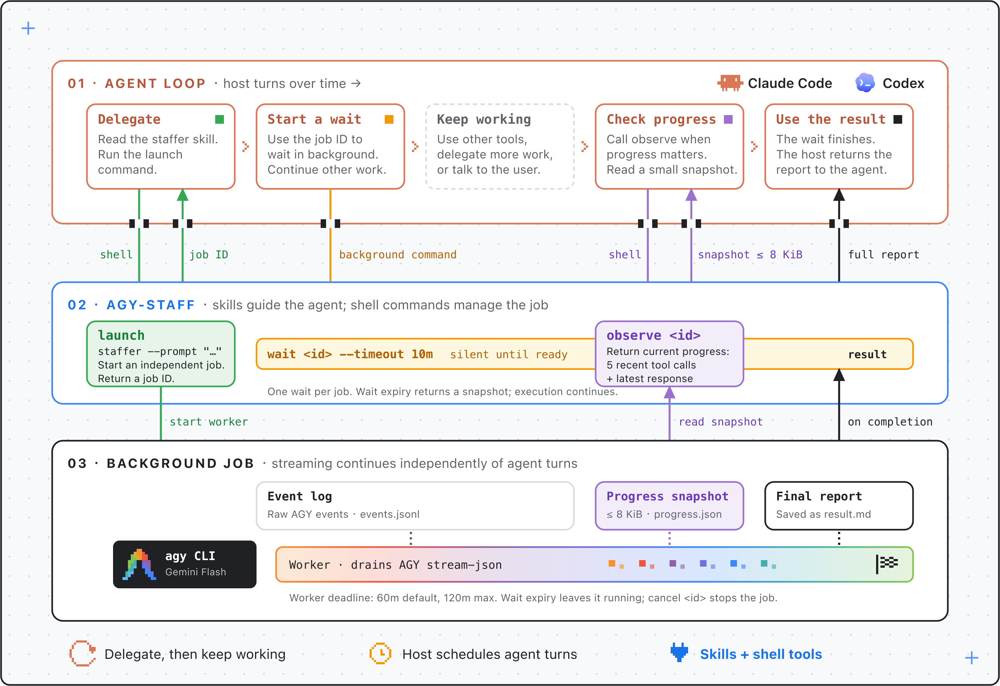

<p align="center"></p>

<p align="center"><a href="README.md">English</a> | <a href="README.zh-CN.md">Simplified Chinese</a></p>

<p align="center"><a href="https://antigravity.google/product/antigravity-cli"></a> </p>

<p align="center"><a href="https://claude.com/claude-code"></a> <a href="https://developers.openai.com/codex/"></a> <a href="LICENSE"></a></p>

**Task orchestration with AGY.**

agy:lead, a task orchestration skill for your agent. Available in **Claude Code**, **OpenAI Codex**, and **Pi**.


**[Install](#install) · [Examples](#cujs) · [Core design](#core-design) · [Upgrade](#upgrade)**

## What & Why

`lead` guides your current agent to delegate substantive work to AGY while owning key decisions, review, and final delivery. It defaults to `staffer`, whose brief defines the work. Use `researcher`, `reviewer`, or `implementer` when their specialist guidance fits the assignment; reserve `ask` for installation smoke tests or explicit testing. The shared `jobs` skill handles collection and follow-ups.

Use AGY for investigation, analysis, writing, planning, and implementation while your current agent retains the wider context and decides what comes next. Continue a useful worker conversation with your feedback, or request an independent review when needed.


## How

### Invoke a skill

Start with `/agy:lead <task>` in Claude Code, `$agy:lead <task>` in Codex, or `/skill:agy-lead <task>` in Pi. Direct persona invocations remain available in the skill picker shown below (screenshots predate lead):


Same plugin in Codex, invoked with `$agy`:


### Install

#### For humans

Step 1 — install the Antigravity CLI ([official docs](https://antigravity.google/docs/cli/install)), then verify with `agy --version`. Node.js is also required:

```bash
curl -fsSL https://antigravity.google/cli/install.sh | bash
```

Step 2 — install the plugin into your harness:

```bash
claude plugin marketplace add keli-wen/agy-staff
claude plugin install agy@agy-staff
```

```bash
codex plugin marketplace add https://github.com/keli-wen/agy-staff
codex plugin add agy@agy-staff
```

<details>
<summary>Using Pi?</summary>

Install: `pi install git:github.com/keli-wen/agy-staff`.
Skills are prefixed as `/skill:agy-<persona>` (e.g. `/skill:agy-ask reply with OK`), with `/skill:agy-jobs` for job management.
Update with `pi update --extension git:github.com/keli-wen/agy-staff`, then run `/reload`.

</details>

Restart Claude Code or Codex afterwards. First run: `/agy:ask reply with OK` (Claude Code) or `$agy:ask reply with OK` (Codex). Ask is tool-free and needs no setup.

> [!IMPORTANT]
> **There is no mandatory setup step.** `staffer`, `researcher`, `reviewer` and `implementer` run **unrestricted** by default: agy can inspect the repo, run commands, and edit files. agy-staff keeps that practical with prompts that adapt to the current repo state. For example, when `implementer` starts in a dirty workspace, the companion tells agy which files already had changes and reminds it not to overwrite or deliver unrelated user work. If the task asks for a commit, push, or PR, agy can do that delivery; otherwise it leaves a working-tree diff for review. These prompt instructions do not provide permission isolation.
> `setup` + `--restricted` is **optional hardening** for untrusted input — per run (`--restricted`) or as a per-repo default (`setup --restrict review,research`). `setup` dry-runs and asks before writing anything ("set up agy" triggers it); read the [permission notes](docs/REFERENCE.md#optional-hardening-setup) first — the allowlist is prefix-matched, applies machine-wide, and a restricted run can return less than an unrestricted one.

#### For agents

Paste this into any coding agent:

```
Read the raw text of https://raw.githubusercontent.com/keli-wen/agy-staff/master/docs/INSTALL_FOR_AGENTS.md (curl it — do not
work from a summary) and follow it to install and verify the agy-staff plugin for the harness you are running in.
Respond in the user's language.
```

#### Upgrade

Claude Code and Codex install a *copy*, so a new version only reaches you when you pull it in yourself:

```bash
claude plugin marketplace update agy-staff && claude plugin update agy@agy-staff
```

```bash
codex plugin marketplace upgrade && codex plugin add agy@agy-staff  # then restart Codex
```

Claude Code and Codex cache per version directory, so an upgrade lands only if the plugin version changed; restart the harness afterwards. If a fix does not show up, see [upgrading](docs/REFERENCE.md#upgrading) — it has the force-refresh command.

### CUJs

Examples below use Claude Code's `/agy:…`; in Codex use `$agy:…`.

| Use case | Invocation |
|---|---|
| Lead an ongoing task | `/agy:lead investigate the options, draft a proposal, and revise it with my feedback` |
| Verify the installation | `/agy:ask reply with OK` |
| A general task | `/agy:staffer summarize the open TODOs in this repo` |
| Generate an image | `/agy:staffer generate a pixel-art robot mascot, save it as assets/mascot.png` |
| Review the working tree | `/agy:reviewer Review the current working tree` |
| Review a PR | `/agy:reviewer Review PR #730` |
| Review a plan or decision | `/agy:reviewer Challenge the migration plan in docs/plan.md` |
| Survey a topic | `/agy:researcher how does auth work in this repo` |
| Implement a scoped fix | `/agy:implementer fix the flaky retry test` |
| Job ops (wait/status/cancel/continue) | natural language: "is the agy job done?", "continue: also check the error path" |

`reviewer` is fully prompt-based: you describe the subject and agy gathers the evidence itself (`gh pr view`, `git diff`, reading the file) — there is no flag for handing it a diff. It has two flavors, routed by subject: code review (severity-ranked findings) and general review (a multi-angle challenge of a plan, design, or decision).

`staffer` also covers agy's native tools without a dedicated specialist persona, including **image generation** (`generate_image`). A trial on agy v1.1.15 produced a 1024×1024 PNG in about 30 seconds; actual time depends on the task and environment.

## Core design

`lead` uses a short orchestrator–worker loop: delegate a coherent outcome, assess the result, then continue, redirect, or deliver. It defaults to `staffer` and keeps related work in one conversation when that context helps. Independent assignments can run in parallel; shared artifacts need clear ownership and common decisions. The current agent composes briefs and synthesizes results, staying within the task's requested scope and stage.

`ask` is the synchronous smoke-test entrypoint. The four worker personas return a job id and a collection command, such as `wait <id> --timeout 10m`. Your agent waits using the host's available capabilities, with one independent background wait per job where supported.

The main agent waits for the final result by default. If you explicitly ask about progress, it can use `observe` to read a snapshot of recent tool activity and response text; it does not query progress for routine updates. Once the task finishes, `wait` or `result` delivers the full report. Expiring a wait leaves the worker running.

The timeline below follows a background task from delegation to completion. The host agent can continue other work, check progress when needed, and collect the final report.

[](assets/integration.svg)

Jobs have a separate execution deadline: default 60 minutes, configurable at launch with `--timeout` up to 120 minutes. Use `cancel` to stop execution, or explicitly request `continue` or `restart` after inspecting the existing work. The host harness controls when your agent receives a background result.

To add instructions after completion, use `continue` on the original job. For an urgent change during execution, cancel the active job, confirm it stopped, then continue with the updated brief. A continuation targeting a conversation with a running background job returns immediately with exit `2` and its active job ID; the new prompt is not sent or queued.

**Full reference →** [docs/REFERENCE.md](docs/REFERENCE.md) (flags, permission model, jobs/state, troubleshooting, upgrading). **Release notes →** [docs/releases/](docs/releases/).

## Community

- [LINUX DO](https://linux.do/) — A next-generation Linux community.

## Contributing

Contributions are welcome — issues, bug reports and pull requests all help.

A few things worth knowing before you open a PR:

- **Run the tests**: `npm test`. The standard suite uses temporary repos and HOME directories with fake `agy`, plus focused module tests. Keep regression tests offline and independent of personal settings. Real AGY validation is a separate opt-in suite described in [tests/README.md](tests/README.md).
- **Docs come in pairs**: `README.md` / `README.zh-CN.md` and `docs/REFERENCE.md` / `docs/REFERENCE.zh-CN.md` are kept in sync. Change one, change its counterpart.
- **Runtime code lives in `companion/`**: the entrypoint handles modes and job commands; separate modules handle streaming execution, observations and state locking. Skills call the companion, and `templates/` holds the shared prompts.
- **Canonical skills are the source of truth**: edit personas in `skills/`, never in `pi-skills/`. Run `npm run generate:pi` to generate Pi entrypoints, and `npm run check:pi` to verify consistency.

Adding a mode or a flag changes the public surface, so please open an issue first and we can agree on the shape.

## License

MIT — see [LICENSE](LICENSE).
