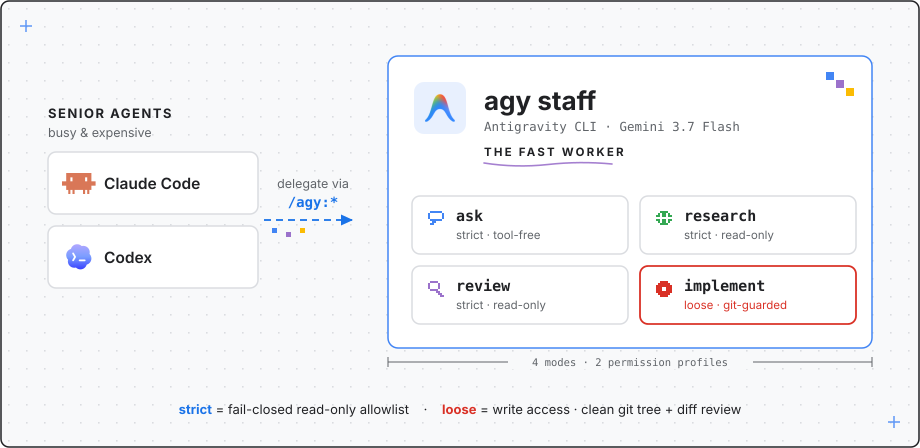

# agy-staff

Hire Google's Antigravity CLI (`agy`) as a staffer for **Claude Code** and **OpenAI Codex**.



## What & Why

Your main agents are busy and expensive. agy-staff lets them delegate to `agy`, which ships fast, free-quota Gemini 3.7 Flash — perfect for quick second opinions, code reviews, deep surveys, and well-scoped implementation tasks. Four modes, one plugin name on both platforms: `/agy:ask`, `/agy:research`, `/agy:review`, `/agy:implement` (plus `continue`/`status`/`result`/`cancel`/`setup`).

Why not the reverse-engineered Antigravity API proxies? They impersonate the IDE's private protocol, violate the Antigravity ToS, and Google bans accounts that use them. The official `agy` binary in headless mode reaches the same free-quota models through a supported surface.

## How

*(screenshots coming soon)*
<!-- screenshot: claude-code -->
<!-- screenshot: codex -->

### Install

Prerequisites: `agy` on PATH (tested with v1.1.13) and Node.js.

```
# Claude Code
/plugin marketplace add /path/to/agy-staff        # or the GitHub slug once pushed
/plugin install agy@agy-staff
```

Codex: add this repo as a plugin source in your marketplace setup (manifest: `.agents/plugins/marketplace.json`), then restart the app. After any update: bump lands only via `codex plugin marketplace upgrade` + app restart.

First run: `/agy:ask "reply with OK"` (smoke test, no setup needed), then `/agy:setup` (installs the read-only allowlist for autonomous evidence gathering).

### For agents

- Modes → defaults: `ask` strict/flash-low/wait · `research` strict/flash-high/wait · `review` strict/flash-medium/wait · `implement` loose/flash-medium/background.
- Model ids are effort-suffixed (`gemini-3.7-flash-low|medium|high`, `gemini-3.1-pro-low|high`); the companion normalizes bare families + `--effort` and the aliases `flash`/`pro`.
- On a companion error: relay the message verbatim and stop — never improvise flags, change directories, or switch repos to satisfy a precondition.
- `review` needs a subject: `--diff-file <path>` (you assemble the diff; never stdin) or `--pr <num>`/`--target <ref>` (agy gathers evidence itself; needs `/agy:setup` once).
- `implement` requires a clean git tree; afterwards show the user the diff — rollback is `git checkout .`.
- Follow-ups: `--continue` (same mode) or `/agy:continue "<text>"` (last conversation; cache-served and cheap).

### CUJs

| You say | Command that runs | What happens |
|---|---|---|
| "quick sanity check: is X true?" | `/agy:ask "is X true?"` | ~3s zero-tool answer from Gemini |
| "review my diff" | `/agy:review` | outer agent assembles your diff; severity-ranked findings with `file:line` refs |
| "review PR `#123`" | `/agy:review --pr 123` | agy fetches the PR via `gh` and reviews autonomously |
| "survey how X works" | `/agy:research "survey X"` | cited deep report with an explicit unverified-claims section |
| "fix that failing test" | `/agy:implement "fix ..."` | agy edits the working tree in the background; you confirm the diff |
| "also check the error path" | `/agy:continue "check the error path"` | continues the last conversation from cache |

**Full reference →** [docs/REFERENCE.md](docs/REFERENCE.md) (flags, permission model, jobs/state, troubleshooting, upgrading).

## License

MIT — see [LICENSE](LICENSE). 中文文档见 [README.zh-CN.md](README.zh-CN.md).
