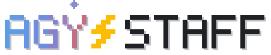
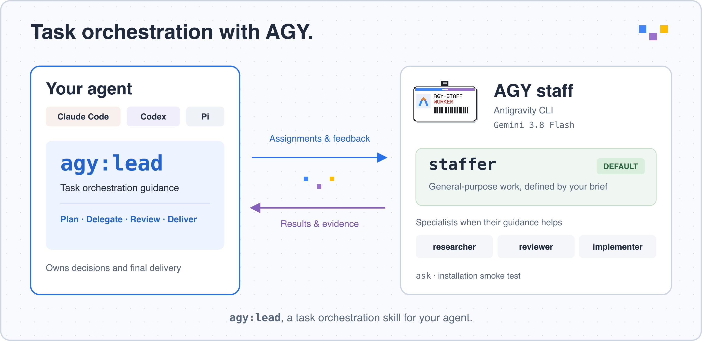
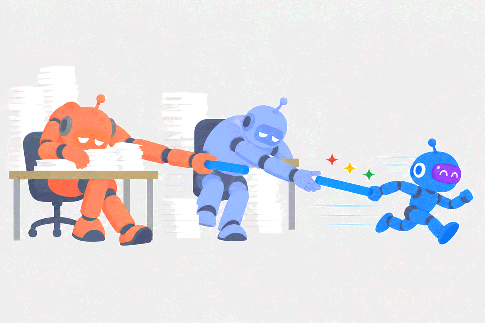
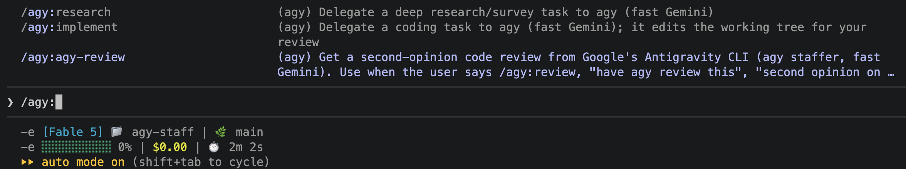
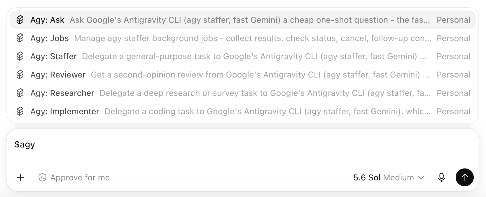

<p align="center"></p>

<p align="center"><a href="README.md">English</a> | <a href="README.zh-CN.md">简体中文</a></p>

<p align="center"><a href="https://antigravity.google/product/antigravity-cli"></a> </p>

<p align="center"><a href="https://claude.com/claude-code"></a> <a href="https://developers.openai.com/codex/"></a> <a href="LICENSE"></a></p>

把 Google 的 Antigravity CLI（`agy`）雇来当 **Claude Code**、**OpenAI Codex** 和 **Pi** 的「agy 员工」。



## What & Why

agy-staff 让主力 agent 把任务委托给 `agy`，后者运行速度很快的 Gemini 3.7 Flash。五个人格，两个平台用同一个插件名：`/agy:staffer`（通用任务）、`/agy:researcher`、`/agy:reviewer`（代码**和**方案/决策都能审）、`/agy:implementer`、`/agy:ask`——另有一个面向模型的 `jobs` skill 管理后台任务（`wait`/`status`/`result`/`cancel`/`continue`/`setup`）。

为什么需要它：GPT-5.6-Sol 开着 fast mode 也慢；Claude Code 快一些，但 Fable 额度有限，更适合用来编排 subagent，而不是亲自做每一次调研和审查。这些任务可以交给 agy：它几秒钟就能给出第二意见，调研和审查以 Flash 的速度完成，范围明确的实现任务放到后台执行，你继续做手头的事。另外，即使不追求速度，让另一个模型家族审同一份代码，也能发现主力 agent 自己发现不了的问题。



## How

在 Claude Code 里输入 `/agy:`，五个人格都在这儿：



同一个插件在 Codex 里用 `$agy` 调用：



### 安装

#### 给人类

第一步——安装 Antigravity CLI（[官方文档](https://antigravity.google/docs/cli/install)），然后用 `agy --version` 验证（v1.1.15 测试通过；另需 Node.js）：

```bash
curl -fsSL https://antigravity.google/cli/install.sh | bash
```

第二步——把插件装进你的 harness：

```bash
claude plugin marketplace add keli-wen/agy-staff
claude plugin install agy@agy-staff
```

```bash
codex plugin marketplace add https://github.com/keli-wen/agy-staff
codex plugin add agy@agy-staff
```

装完**重启 harness**，技能才会加载。首次运行：`/agy:ask "reply with OK"`——ask 不用任何工具、不需要 setup，装完就能用。

> [!IMPORTANT]
> **没有必须先做的 setup 步骤。** `staffer`、`researcher`、`reviewer`、`implementer` 默认以 **unrestricted** 档运行：agy 可以自己看仓库、跑命令、改文件。agy-staff 靠一层会看当前仓库状态的 prompt 来约束它。比如 `implementer` 遇到 dirty workspace 时，companion 会告诉 agy 哪些文件本来就有改动，并提醒它不要覆盖或交付无关的用户改动。只有任务明确要求 commit、push 或 PR 时，agy 才做对应交付；否则它只留下工作区 diff 供你审查。
> `setup` + `--restricted` 是**可选的加固手段**，处理不可信输入时才需要——既可按次传 `--restricted`，也可用 `setup --restrict review,research` 设为本仓库默认。`setup` 会先 dry run，经你确认才写入（对 agent 说「set up agy」即可触发）；用之前请读[权限说明](docs/REFERENCE.zh-CN.md#可选加固-setup)——allowlist 按前缀匹配、对整台机器生效，restricted 档运行返回的内容也可能比 unrestricted 少。

#### 给 Agent

把下面这段话直接粘贴给任何 coding agent：

```
Read the raw text of https://raw.githubusercontent.com/keli-wen/agy-staff/master/docs/INSTALL_FOR_AGENTS.md
(curl it — do not work from a summary), or the same file in your local checkout of agy-staff, and follow it to
install and verify the agy-staff plugin for the harness you are running in. Respond in the user's language.
```

#### 升级

两个 harness 装的都是**拷贝**，所以新版本要你主动拉一次才会生效：

```bash
claude plugin marketplace update agy-staff && claude plugin update agy@agy-staff
```

```bash
codex plugin marketplace upgrade && codex plugin add agy@agy-staff  # then restart Codex
```

两个 harness 都按版本号目录缓存插件，只有插件版本号变了升级才会落地，之后还要重启 harness。改动没出现时见[升级](docs/REFERENCE.zh-CN.md#升级)——那里有强制刷新的命令。

### 典型场景（CUJ）

调用永远是显式的：命令由你亲手输入，插件不会因为对话里出现某些词就自行触发。示例用 Claude Code 的 `/agy:…` 写法；Codex 里同一批 skill 写作 `$agy:…`。

| 使用场景 | 调用 |
|---|---|
| 快速第二意见 | `/agy:ask 你的后端模型是什么` |
| 通用任务 | `/agy:staffer 汇总这个仓库里所有未完成的 TODO` |
| 生成一张图片 | `/agy:staffer 生成一个像素风机器人吉祥物，存为 assets/mascot.png` |
| 审查当前工作区 | `/agy:reviewer Review the current working tree` |
| 审查某个 PR | `/agy:reviewer Review PR #730` |
| 审查一个方案/决策 | `/agy:reviewer Challenge docs/plan.md 里的迁移方案` |
| 调研一个主题 | `/agy:researcher 这个仓库的鉴权是怎么做的` |
| 实现一个范围明确的修复 | `/agy:implementer 修复那个不稳定的重试测试` |
| 任务管理（等待/进度/取消/续接） | 自然语言：「agy 的 job 好了吗」「continue：再看看错误路径」 |

`reviewer` 完全靠 prompt 描述审查对象，agy 自己去收集证据（`gh pr view`、`git diff`、直接读文件）；没有任何 flag 可以直接传入 diff。它有两个 flavor，按对象自动路由：代码审查（severity 分级的 findings）和通用审查（对方案、设计、决策的多角度 challenge）。

`staffer` 还能解锁 agy 的原生工具中没有专职人格覆盖的部分——最值得一提的是**图像生成**（`generate_image`；在 agy v1.1.15 上实测，约 30 秒产出 1024×1024 PNG）。

`ask` 在同一次调用里返回答案。其余人格作为后台任务运行：调用立即返回 job id，并打印确切的收取命令（`wait <id> --timeout <n>m`）；你的 agent 把它作为后台命令运行——一个 job 一个 wait——完成时交付结果。

**完整参考 →** [docs/REFERENCE.zh-CN.md](docs/REFERENCE.zh-CN.md)（flags、权限模型、任务/状态、疑难排查、升级）。**Release notes →** [docs/releases/](docs/releases/)。

## 社区

- [LINUX DO](https://linux.do/) — 新一代的 Linux 社区。

## 参与贡献

欢迎贡献——提 issue、报 bug、发 PR 都可以。

发 PR 之前有三件事需要知道：

- **跑测试**：`node --test tests/*.test.mjs`。这些是黑盒测试，跑在一次性的仓库和 HOME 里，用假的 `agy`（`tests/fake-agy.mjs`）替代真实二进制，所以不会联网、也不会碰你真实的配置。请保持这个性质：测试永远不要调用真的 `agy`。
- **文档是成对的**：`README.md` / `README.zh-CN.md`、`docs/REFERENCE.md` / `docs/REFERENCE.zh-CN.md` 保持同步。改了一份，就要改它的对应版本。
- **行为都在一个文件里**：`companion/agy-companion.mjs` 承载全部逻辑，skills 只是转发的薄壳，护栏写在 `templates/` 的 prompt 模板里。

新增模式或 flag 会改变对外接口，请先开 issue 讨论形态，再动手。

## 许可证

MIT — 见 [LICENSE](LICENSE)。
