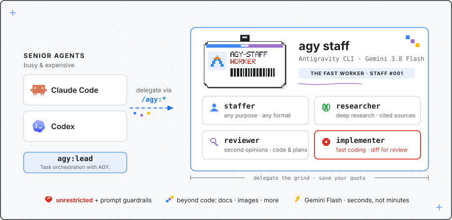
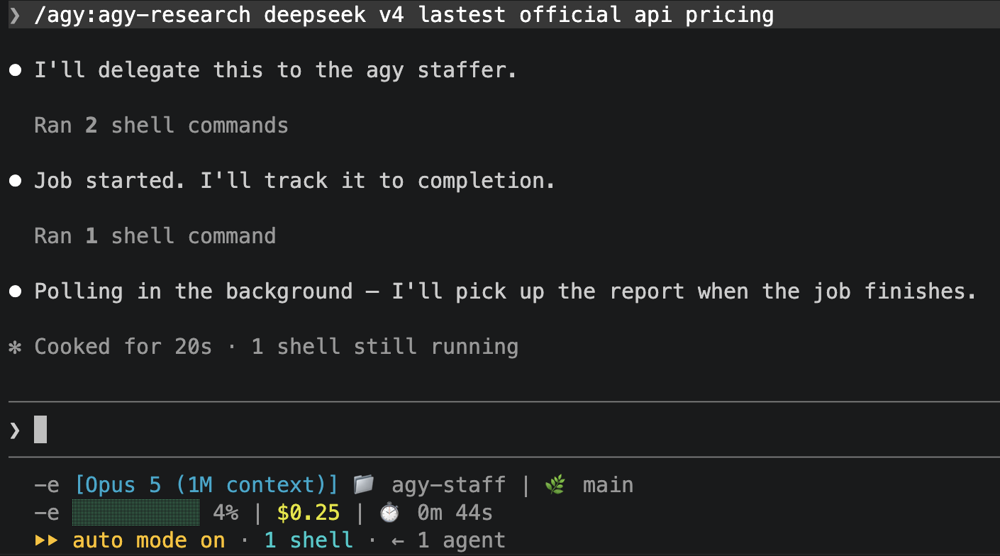

<p align="center"></p>

<p align="center"><a href="README.md">English</a> | <a href="README.zh-CN.md">简体中文</a></p>

<p align="center"><a href="https://antigravity.google/product/antigravity-cli"></a>  <a href="https://claude.com/claude-code"></a> <a href="https://developers.openai.com/codex/"></a> <a href="LICENSE"></a></p>

把 Google 的 Antigravity CLI（`agy`）雇来当 **Claude Code** 和 **OpenAI Codex** 的「agy 员工」。



## What & Why

agy-staff 让主力 agent 把任务委托给 `agy`，后者运行速度很快的 Gemini 3.7 Flash。四种模式，两个平台用同一个插件名：`/agy:ask`、`/agy:research`、`/agy:review`、`/agy:implement`（另有 `continue`/`wait`/`status`/`result`/`cancel`/`setup`）。

为什么需要它：GPT-5.6-Sol 开着 fast mode 也慢；Claude Code 快一些，但 Fable 额度有限，更适合用来编排 subagent，而不是亲自做每一次调研和审查。这些任务可以交给 agy：它几秒钟就能给出第二意见，调研和审查以 Flash 的速度完成，范围明确的实现任务放到后台执行，你继续做手头的事。另外，即使不追求速度，让另一个模型家族审同一份代码，也能发现主力 agent 自己发现不了的问题。


## How

在 Claude Code 里输入 `/agy:`，四种模式和任务管理命令都在这儿：


同一个插件在 Codex 里用 `$agy` 调用：


委托出去是这样的——几秒钟就返回一个 job id，agy 在后台干活，你的主力 agent 继续往前走：



### 安装

#### 给人类

第一步——安装 Antigravity CLI（[官方文档](https://antigravity.google/docs/cli/install)），然后用 `agy --version` 验证（v1.1.13 测试通过；另需 Node.js）：

```bash
curl -fsSL https://antigravity.google/cli/install.sh | bash
```

第二步——把插件装进你的 harness：

```
/plugin marketplace add keli-wen/agy-staff
/plugin install agy@agy-staff
```

```bash
codex plugin marketplace add https://github.com/keli-wen/agy-staff
codex plugin add agy@agy-staff
```

首次运行：`/agy:ask "reply with OK"`——ask 不用任何工具、不需要 setup，装完就能用。

> [!IMPORTANT]
> **没有必须先做的 setup 步骤。** `research`、`review`、`implement` 默认以 **unrestricted** 档运行：agy 自己收集证据、自己改文件。护栏有两层：prompt 模板（不 commit/push、不做花钱或不可逆的操作），加上 `implement` 启动前的 git 工作区干净检查。
> `/agy:setup` + `--restricted` 是**可选的加固手段**，处理不可信输入时才需要——既可按次传 `--restricted`，也可用 `setup --restrict review,research` 设为本仓库默认。`setup` 会先 dry run，经你确认才写入；用之前请读[权限说明](docs/REFERENCE.zh-CN.md#可选加固-setup)——allowlist 按前缀匹配、对整台机器生效，restricted 档运行返回的内容也可能比 unrestricted 少。

#### 给 Agent

把下面这段话直接粘贴给任何 coding agent：

```
Read docs/INSTALL_FOR_AGENTS.md in https://github.com/keli-wen/agy-staff (or in your
local checkout of agy-staff) and follow it to install and verify the agy-staff plugin
for the harness you are running in. Respond in the user's language.
```

### 典型场景（CUJ）

调用永远是显式的：命令由你亲手输入，插件不会因为对话里出现某些词就自行触发。

| 使用场景 | Claude Code | Codex |
|---|---|---|
| 快速第二意见 | `/agy:agy-ask 你的后端模型是什么` | `$agy:agy-ask 你的后端模型是什么` |
| 审查当前工作区 | `/agy:agy-review Review the current working tree` | `$agy:agy-review Review the current working tree` |
| 审查某个 PR | `/agy:agy-review Review PR #730` | `$agy:agy-review Review PR #730` |
| 对比某个分支审查 | `/agy:agy-review Review changes against master` | `$agy:agy-review Review changes against master` |
| 审查一个补丁文件 | `/agy:agy-review Review the patch at /tmp/change.patch` | `$agy:agy-review Review the patch at /tmp/change.patch` |
| 调研一个主题 | `/agy:agy-research 这个仓库的鉴权是怎么做的` | `$agy:agy-research 这个仓库的鉴权是怎么做的` |
| 实现一个范围明确的修复 | `/agy:agy-implement 修复那个不稳定的重试测试` | `$agy:agy-implement 修复那个不稳定的重试测试` |
| 续接最近的会话 | `/agy:continue 再看看错误路径` | `$agy:agy-jobs continue 再看看错误路径` |

`review` 完全靠 prompt 描述审查对象，agy 自己去收集证据（`gh pr view`、`git diff`、直接读文件）；没有任何 flag 可以直接传入 diff。

`ask` 在同一次调用里返回答案。`research`、`review`、`implement` 作为后台任务运行：调用立即返回一个 job id，之后用 `/agy:wait <id>` 阻塞等待并直接拿到结果（`/agy:status` 查看进度，`/agy:cancel <id>` 终止）。

**完整参考 →** [docs/REFERENCE.zh-CN.md](docs/REFERENCE.zh-CN.md)（flags、权限模型、任务/状态、疑难排查、升级）。

## 许可证

MIT — 见 [LICENSE](LICENSE)。
