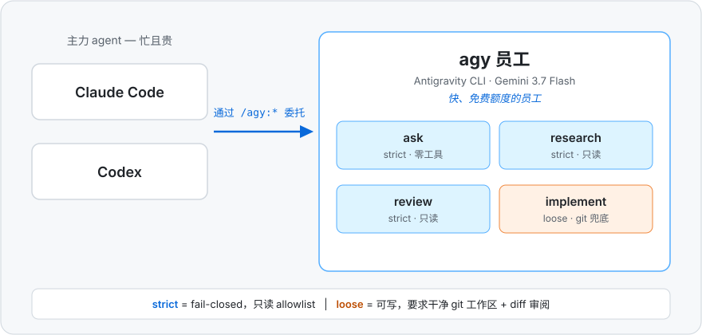

# agy-staff

把 Google 的 Antigravity CLI（`agy`）雇来当 **Claude Code** 和 **OpenAI Codex** 的「agy 员工」。



## What & Why

主力 agent 又忙又贵。agy-staff 让它们把活儿委托给 `agy`——自带快速、免费额度的 Gemini 3.7 Flash——非常适合快速第二意见、代码审查、深度调研和边界清晰的实现任务。四种模式，两个平台同一个插件名：`/agy:ask`、`/agy:research`、`/agy:review`、`/agy:implement`（另有 `continue`/`status`/`result`/`cancel`/`setup`）。

为什么不用逆向的 Antigravity API 代理？它们伪装 IDE 私有协议、违反 Antigravity 服务条款，Google 会封禁使用它们的账号。官方 `agy` 二进制的 headless 模式通过受支持的方式提供同样的免费额度模型。

## How

*（截图即将补充）*
<!-- screenshot: claude-code -->
<!-- screenshot: codex -->

### 安装

前置条件：`agy` 在 PATH 上（v1.1.13 测试通过）以及 Node.js。

```
# Claude Code
/plugin marketplace add /path/to/agy-staff        # 推送到 GitHub 后也可用仓库 slug
/plugin install agy@agy-staff
```

Codex：把本仓库作为插件源加入你的 marketplace 配置（manifest：`.agents/plugins/marketplace.json`），然后重启应用。之后每次更新：需 `codex plugin marketplace upgrade` + 重启应用才会生效。

首次运行：先 `/agy:ask "reply with OK"`（冒烟测试，无需任何 setup），再 `/agy:setup`（安装只读 allowlist，启用自主取证）。

### 给 Agent 的说明

- 模式 → 默认值：`ask` strict/flash-low/前台 · `research` strict/flash-high/前台 · `review` strict/flash-medium/前台 · `implement` loose/flash-medium/后台。
- 模型 id 必须带 effort 后缀（`gemini-3.7-flash-low|medium|high`、`gemini-3.1-pro-low|high`）；companion 会自动补全裸 family + `--effort`，并接受别名 `flash`/`pro`。
- companion 报错时：把错误信息原样转述给用户并停止——不要自行猜 flag、切换目录或换仓库来绕过前置条件。
- `review` 需要审查对象：`--diff-file <path>`（由你组装 diff；绝不走 stdin）或 `--pr <num>`/`--target <ref>`（agy 自主取证；需先运行一次 `/agy:setup`）。
- `implement` 要求干净的 git 工作区；结束后把 diff 展示给用户——回滚是 `git checkout .`。
- 追问：`--continue`（同模式）或 `/agy:continue "<文本>"`（最近会话；走缓存、很省额度）。

### 典型场景（CUJ）

| 你说 | 实际执行的命令 | 发生什么 |
|---|---|---|
| “快速确认一下：X 对吗？” | `/agy:ask "X 对吗？"` | 约 3s 的零工具回答 |
| “review 一下我的 diff” | `/agy:review` | 外层 agent 组装 diff；按严重度排序、带 `file:line` 的 findings |
| “review 一下 PR `#123`” | `/agy:review --pr 123` | agy 自己用 `gh` 拉取 PR 并自主审查 |
| “调研一下 X 是怎么工作的” | `/agy:research "调研 X"` | 带引用的深度报告，显式列出未验证结论 |
| “修一下那个失败的测试” | `/agy:implement "修复……"` | agy 在后台修改工作区；由你确认 diff |
| “再看看错误处理路径” | `/agy:continue "检查错误路径"` | 从缓存续接最近的会话 |

**完整参考 →** [docs/REFERENCE.zh-CN.md](docs/REFERENCE.zh-CN.md)（flags、权限模型、任务/状态、疑难排查、升级）。

## 许可证

MIT — 见 [LICENSE](LICENSE)。English documentation: [README.md](README.md).
