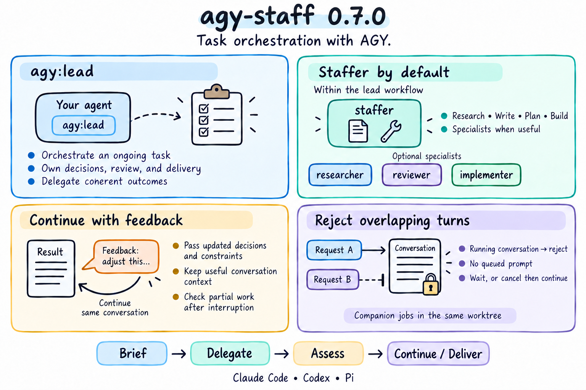

# agy-staff 0.7.0 — Task orchestration with AGY

Adds `agy:lead`, a task orchestration skill for your agent. Within this workflow, the host delegates substantive work to `staffer` by default, selects specialist guidance when useful, and reserves `ask` for testing. The host retains decisions, review, and delivery. Existing persona skills are unchanged.

The jobs guidance covers follow-ups after completion, waiting for useful work, and canceling before an immediate change of direction. Follow-up briefs carry host decisions and account for partial work after interruption. The companion now refuses to continue a conversation whose job is still running, returning the job ID and status without queueing the follow-up, so the orchestrator decides whether to wait or cancel.

Includes the generated Pi lead entrypoint, minimal usage documentation, and a lead badge added to the existing homepage diagram. Controlled real-AGY tests passed for overlapping-turn rejection, explicit resubmission, and cancel-then-continue. Real-model lead quality and lossless recovery after arbitrary interruptions remain unvalidated.
