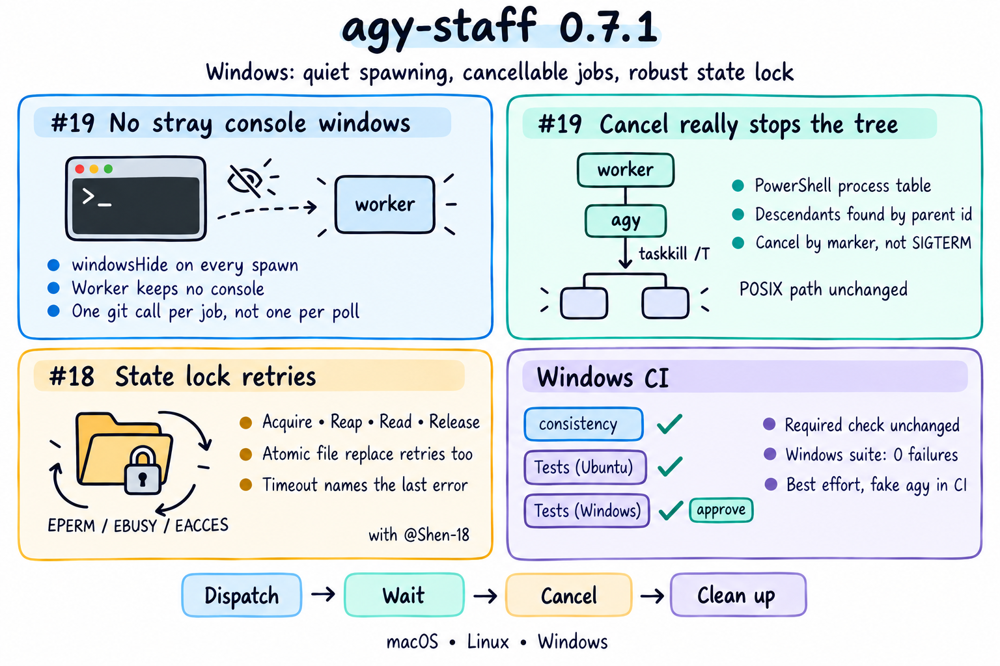

# agy-staff 0.7.1 — Windows: quiet spawning, cancellable jobs, robust state lock

## Changes since 0.7.0

0.7.0 added task orchestration. This release makes the companion usable on Windows, where it had never been run. Behaviour on macOS and Linux is unchanged.

- [#19](https://github.com/keli-wen/agy-staff/issues/19): background jobs no longer open console windows and can be canceled. Every `spawn`/`spawnSync` in the companion now passes `windowsHide: true`; the detached worker has no console of its own, so its `git` and process-inspection children get none either. The repository root is memoized per working directory instead of forking `git rev-parse` on every 200 ms `wait` poll and 100 ms cancel check, which was the source of the window storm. Process-tree inspection uses PowerShell `Get-CimInstance Win32_Process` (with `wmic` fallback) and termination uses `taskkill /PID <pid> /T /F`; on POSIX the `ps` and process-group paths are byte-for-byte the same. `cancel` on Windows relies on the cancellation marker the worker already polls rather than `SIGTERM`, which is `TerminateProcess` there and would orphan the agy tree.
- [#18](https://github.com/keli-wen/agy-staff/pull/18) (contributed by [@Shen-18](https://github.com/Shen-18)): the job state lock retries `EPERM`/`EBUSY`/`EACCES` when acquiring, reaping, reading and releasing the lock directory. Windows reports those where POSIX reports `EEXIST`/`ENOTEMPTY`, so every job previously failed on its first state write. Releasing retries the marker unlink instead of ignoring the error, which had left the process's own marker behind and turned every later lock into a 10 s timeout. Lock timeouts now name the last error code.
- Atomic file replacement (`state.json`, progress and status files) retries Windows sharing violations, since `wait` and `status` read those files every few hundred milliseconds. Reading `state.json` treats only a missing file as an empty state; any other read error is reported instead of being written back as empty, which could have erased job records.
- [#20](https://github.com/keli-wen/agy-staff/pull/20): CI is split into three jobs. `Generated skills consistency` (the required check) runs the Pi alignment check; `Tests (Ubuntu)` runs the suite automatically; `Tests (Windows)` runs it on `windows-latest` behind the `manual-tests` environment, so a maintainer approves each Windows run. A script-file `AGY_BIN` (the test fake) is launched through Node because Windows has no shebang support. `.gitattributes` pins LF on checkout.

Package, Claude Code and Codex manifests are aligned at 0.7.1. Canonical skills and generated Pi skills are unchanged. No CLI flags, exit codes or output formats changed.

## Validation

The offline suite passed 189/189 on macOS. On the Windows runner, 0.7.0 scored 81 pass / 92 fail in 26 minutes; this release scores 188 pass / 0 fail / 1 skipped (a test that shims POSIX `ps`) in about 4 minutes. New unit tests cover the `windowsHide` invariant over the companion sources, `repoRoot` memoization, process-table parsing for PowerShell and wmic output, taskkill routing, and the lock's `EPERM` paths, with the platform-specific pieces injected so they run on POSIX hosts. Two intermittent Windows failures seen during iteration (a slow process-table query making cleanup skip the tree, and a rename colliding with a reader) were fixed and did not recur.

Windows support is best effort. The CI job uses the fake agy; no real Windows `agy` installation was exercised. If `agy` installs there as an npm-style `agy.cmd`, Node refuses to spawn it without a shell, and that case is not handled yet. PowerShell output under non-UTF-8 code pages and `taskkill` behaviour on protected processes are covered by stubs only.
